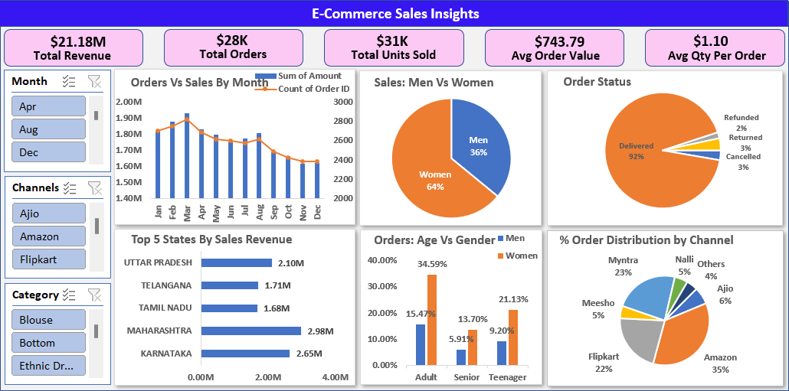

# E-Commerce_Sales_Insights
Examining e-commerce sales data to uncover key performance trends, customer behavior, and revenue patterns and provide actionable insights using Excel, Python, and SQL.
## Table of Contents
- [Overview](#overview)
- [Problem Statement](#problem-statement)
- [Dataset Details](#dataset-details)
- [Tools & Technologies](#tools--technologies)
- [Project Structure](#project-structure)
- [Methodology](#methodology)
- [Dashboard](#dashboard)
- [Key Insights](#key-insights)
- [Suggestions](#suggestions)
- [How to Run This Project](#how-to-run-this-project)
- [Author & Contact](#author--contact)


---

## Overview
This project provides a data-driven analysis of e-commerce sales performance, transforming raw transactional data into a comprehensive business intelligence solution. It leverages Python ford data cleaning and KPI computation, SQL for sales performance analysis, and Excel for dashboard visualization. The interactive dashboards enable multi-dimensional exploration of sales metrics such as revenue, order trends, product performance, customer demographics, and regional insights. This project demonstrates a scalable framework for converting raw sales data into actionable insights that support data-driven decision-making and strategic business growth.

## Problem Statement
In the rapidly expanding e-commerce industry, businesses generate huge volumes of sales and customer data. 
However, this data is often inconsistent, unstructured, duplicated, making it difficult to analyze and extract meaningful 
insights. Such data complexity limits the ability to track performance, identify trends, and understand customer 
behavior. As a result, companies struggle to make informed, data-driven decisions and miss potential growth 
opportunities, leading to inefficiencies in marketing, inventory management, and overall strategic planning. 

To address this challenge, this project uses a Kaggle/GitHub e-commerce dataset and implements a complete data 
analytics workflow integrating Python, SQL, and Excel. Python is used for data cleaning and key performance 
aggregations, SQL for analyzing sales performance through structured queries, and Excel for building an interactive 
dashboard that visually represents major sales trends and insights. 

The aim of this project is to demonstrate how a unified and structured analytical process can transform raw e
commerce data into clear, visual, and insight-driven business intelligence, enabling more informed and effective 
business decisions.


## Dataset Details
- Dataset Source: Public Dataset (Kaggle/GitHub) 
- Dataset Name: Ecommerce Sales Performance 
- Raw Data Size: 31048 Rows and 19 Columns 
- Cleaned Data Size: 31048 Rows and 15 Columns


## Tools & Technologies
-  Excel: Dashboards, Power Query, Power Pivot, Pivot Charts, Slicers. 
- SQL: COUNT, GROUP BY, ORDER BY, Subqueries for data extraction and aggregation. 
- Python (Jupyter Notebook): Pandas, NumPy, Seaborn. 
- MS Word: Report preparation and documentation of findings.
## Project Structure


```bash
E-Commerce_Sales_Insights/
│
├── README.md                                           # Project overview, objectives, and usage
├── .gitignore                                         # Files/folders to ignore in Git
│
├── dataset/                                           # Raw datasets used for analysis
│   └── e-commerce_sales_insights(raw_dataset).xlsx
│
├── sql_and_python_scripts/                            # SQL and Python scripts
│   ├── Data_Cleaning_and_KPIs_Python.ipynb
│   └── Sales_Performance_SQL_Queries.sql
│
├── dashboard/                                        # Excel dashboard and cleaned data
│   └── e-commerce_sales_insights(dashboard).xlsx
│
├── snapshots/                                        # Dashboard snapshots & visuals
│   ├── E-Commerce_Sales_Insights.png
│   ├── Orders_and_Sales_by_Month.png
│   ├── Top_5_States_by_Sales_Revenue.png
│   ├── Sales_by_Gender.png
│   ├── Orders_by_Age_Group_and_Gender.png
│   ├── Order_Status.png
│   └── Order_Distribution_by_Channel.png
│
└── reports/                                          # Analysis reports (PDFs, exports)
    ├── E-Commerce_Sales_Insights_Excel_Report.pdf
    └── E-Commerce_Sales_Insights_Python_and_SQL_Report.pdf


    

```

## Methodology
- Data Collection: Gathered public datasets from Kaggle and GitHub. 
-  Data Cleaning: Removed duplicates, corrected inconsistencies, and standardized formats using 
Python libraries Pandas and NumPy. 
- Data Preparation: Created calculated columns for business metrics in Excel. 
- Data Aggregation: Computed key performance indicators (KPIs) in Python Jupyter Notebook. 
- Data Analysis: Applied SQL functions such as GROUP BY, ORDER BY, and subqueries to analyze 
sales performance and trends. 
- Visualization: Developed interactive dashboards in Excel with charts, KPIs, and slicers. 
## Dashboard
EXCEL Dashboard Shows:

1. KPI Cards (Top Row): Displays key business metrics — Total Revenue, Total Orders, Total Units Sold, Average Order Value, and Average Quantity Per Order — enabling quick performance assessment.

2. Orders vs Sales by Month (Combo Chart): Shows month-wise comparison of total sales revenue and order count, helping identify seasonal trends and peak performance periods.

3. Sales by Gender (Pie Chart): Compares sales contributions between men and women, offering insights into gender-based purchasing behavior and target demographics.

4. Order Status Distribution (Pie Chart): Represents the percentage of orders by status — delivered, returned, refunded, and canceled — to evaluate fulfillment efficiency and customer satisfaction.

5. Top 5 States by Total Sales Revenue (Bar Chart): Highlights the five states contributing the most to total sales, identifying high-performing market regions.

6. Orders by Age Group and Gender (Clustered Column Chart): Displays order distribution across different age groups segmented by gender, uncovering key demographic patterns.

7. Order Distribution by Channel (Pie Chart): Visualizes the share of total orders across sales channels such as Amazon, Flipkart, and Ajio, allowing channel performance comparison.

8. Interactive Slicers (Left Pane): Includes slicers for Month, Sales Channel, and Product Category, enabling users to perform drill-down analysis and gain customized insights.





## Key Insights
1. Sales peaked in March at $1.95M, followed by a 16.9% decline toward December, reflecting clear seasonality.
2. Women contribute around 65% of total sales, with the 30–39 age group as the dominant segment.
3. Maharashtra and Karnataka together account for over 50% of total state sales, followed by UP, Telangana, and Tamil Nadu.
4. Order fulfillment efficiency is high, with 92% of orders delivered and minimal cancellations or returns.
5. Amazon, Flipkart, and Myntra drive about 80% of total orders, while other platforms share the remaining 20%.

## Suggestions
1. Implement targeted promotions and special offers from Q2 to Q4 to reduce seasonal sales fluctuations. 
2. Develop marketing campaigns to increase male customer engagement. 
3. Focus retention strategies on adult and teenage female segments to boost loyalty. 
4. Expand marketing and distribution in Uttar Pradesh, Telangana, and Tamil Nadu. 
5. Maintain high fulfillment standards and optimize return, cancellation, and refund processes. 
6. Strengthen partnerships with niche platforms and explore emerging sales channels. 
7. Target women aged 30-39 in Maharashtra, Karnataka, and Uttar Pradesh with focused advertising, offers, and 
coupons on Amazon, Flipkart, and Myntra platforms.
## How to Run This Project

1. Clone the Repository:
```bash
git clone https://github.com/Anjaneyak24/e-commerce_sales_insights.git
```
2. Click the links below to open the SQL and Python scripts:

- [Sales Performance SQL Queries](scripts/Sales_Performance_SQL_Queries.sql)

- [Data Cleaning and KPIs (Python)](scripts/Data_Cleaning_and_KPIs_Python.ipynb)


3. Click the link below to view the EXCEL Dashboard:
 - - [E-Commerce Sales Insights Dashboard](dashboard/e-commerce_sales_insights_dashboard.xlsx)

4. Click the links below to view the EXCEL and Python & SQL reports in pdf:
- [E-Commerce Sales Insights Excel Report](reports/E-commerce_Sales_Insights_Excel_Report.pdf)
- [E-Commerce Sales Insights Python and SQL Report](reports/E-commerce_Sales_Insights_Python_and_SQL_Report.pdf)

5. Click the link below to view Raw Dataset:
 - [E-Commerce Sales (Raw Dataset)](dataset/e-commerce_sales(raw_dataset).xlsx)

## Author & Contact

**Anjaneya K**  
 Data Analyst / Bussiness Analyst  
📧 Email: anjaneyak3.142@gmail.com / anjaneyab3.142@gmail.com
